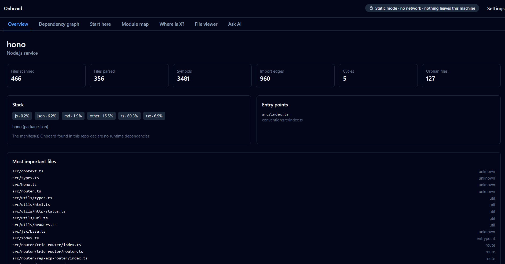

# Onboard

**Understand any codebase in minutes, not days.**

Onboard maps a local repo into a guided walkthrough: entry points and the order to read them in, a module map, a dependency graph, and the files that actually carry weight. Built for the days you lose joining an unfamiliar codebase — a new job, a client handover, an open-source project you want to contribute to.

Free, open source, and offline by default. No account, no server, no telemetry.

**[Download for Windows or Linux →](https://app-onboard.netlify.app)**

## Why

You join a project mid-way. There are 40,000 lines, the README is out of date, and the person who wrote most of it left months ago. You spend three days reading code before you can change a single line.

Onboard is the tool I wanted during those three days.

## What it does

- **Overview** — project type, stack breakdown, entry points, and the most important files ranked by how much the rest of the codebase depends on them
- **Start here** — a reading order through the codebase instead of an alphabetical file tree
- **Module map** — what each folder is for, its key files, and what it depends on
- **Dependency graph** — click through imports between modules and files
- **Where is X?** — find where a concept lives without knowing the file names
- **File viewer** — read files without leaving the app

## Runs offline

Analysis is static and happens entirely on your machine. In static mode — the default, and the whole product — Onboard makes no network calls at all: no telemetry, no crash reporting, no analytics, no update check. Not configurable-off; absent.

That privacy model is enforced by checks in CI rather than promised in this file. The analysis engine cannot open a socket — lint refuses the imports, a runtime guard blocks them, and CI runs a full analysis with network namespaces unshared. All outbound traffic, which exists only if you turn AI on, goes through a single chokepoint in the Rust layer, and the build fails if a second one ever appears.

Your code never leaves your computer.

## Optional AI

Off until you turn it on, and it takes both a stored key and the master toggle — either alone leaves you in static mode. Turn it on and you can ask questions about the repo in plain language.

When it is on, the mode indicator says so and names the provider and model, every answer reports the actual number of files and bytes sent, and snippets are redacted before any byte leaves the process. An answer citing a file that is not in the index is refused outright rather than shown with a caveat. Choose **Ollama** instead of a cloud provider and even that stays on your machine. Your API key lives in the OS keychain — never in a config file, a log, or an IPC response.

## Install

Download the installer for your platform from the [releases page](https://github.com/kodeksidev/onboard/releases/latest):

- Windows: `Onboard_<version>_x64-setup.exe` — installs per-user, no administrator rights, no UAC prompt
- Linux: `.deb` or `.rpm`
- macOS: in progress

The Windows installer isn't code-signed yet, so SmartScreen will warn you. Click **More info → Run anyway**. Full steps, including macOS, are in [docs/INSTALL.md](docs/INSTALL.md).

## Built with

Tauri (Rust shell), a TypeScript analysis engine running as a sidecar process, React UI. CI builds on Windows, Linux and macOS.

## Status

Early. It works, and it's had several releases, but it will get things wrong on repos it hasn't seen. If it does, [open an issue](https://github.com/kodeksidev/onboard/issues) — knowing what it got wrong on your repo is the most useful thing you can send me.

JS/TS/TSX and Python only for now; [docs/V2_BACKLOG.md](docs/V2_BACKLOG.md) has the full list of what v1 deliberately leaves out, and [docs/CRITERIA_MAP.md](docs/CRITERIA_MAP.md) is generated from what CI actually runs rather than written by hand.

## Licence

MIT
